# What Happens When You Type https://www.google.com and Press Enter: A Complete Technical Breakdown

When you type `https://www.google.com` into your browser's address bar and press enter, it seems like an instantaneous action. However, behind the scenes, a complex series of events unfolds across multiple layers of the internet stack. This article will walk you through each step of this journey, from the initial DNS lookup to the rendering of the final webpage on your screen.

## Visual Overview of the Request Flow

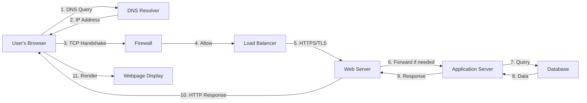

## The User's Intent: Starting the Journey

You've typed the URL and pressed enter. Your browser now needs to translate this human-readable domain name into an actual IP address where the server lives. This is where our first critical component comes into play.

## DNS Request: Finding the Address

The Domain Name System (DNS) is essentially the phonebook of the internet. When your browser receives the URL `https://www.google.com`, it doesn't know the actual IP address associated with this domain yet. It must perform a DNS lookup.

Your browser first checks its own DNS cache to see if it has recently resolved this domain. If not found, it contacts your configured DNS resolver, typically provided by your Internet Service Provider (ISP) or a public service like Google's 8.8.8.8 or Cloudflare's 1.1.1.1.

The DNS resolver performs a recursive query through the DNS hierarchy:

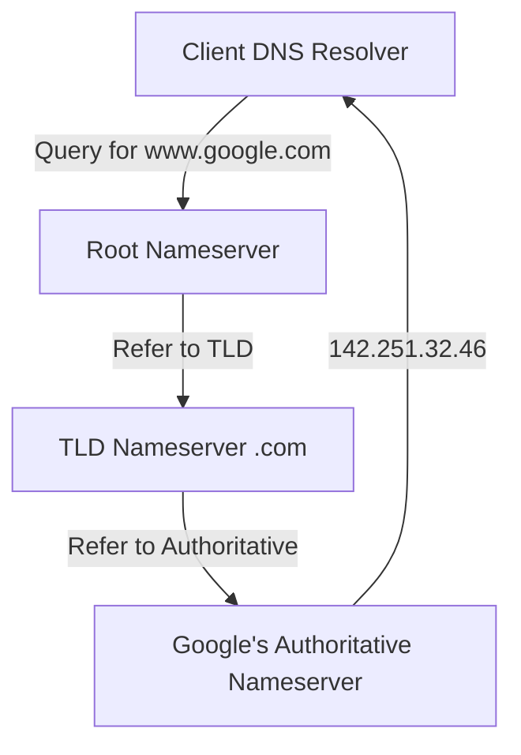

This returns Google's IP address, let's say `142.251.32.46`. This IP address is cached locally for future requests, typically for a Time To Live (TTL) period specified by Google's DNS configuration.

Without DNS, you would need to memorize numerical IP addresses instead of human-friendly domain names. This protocol is fundamental to making the internet navigable.

## TCP/IP: Establishing the Connection

Now your browser has the IP address. The next step is to establish a connection to Google's server using the TCP/IP protocol suite.

Your browser initiates a TCP three-way handshake with the server at `142.251.32.46` on port 443, which is the standard port for HTTPS traffic.

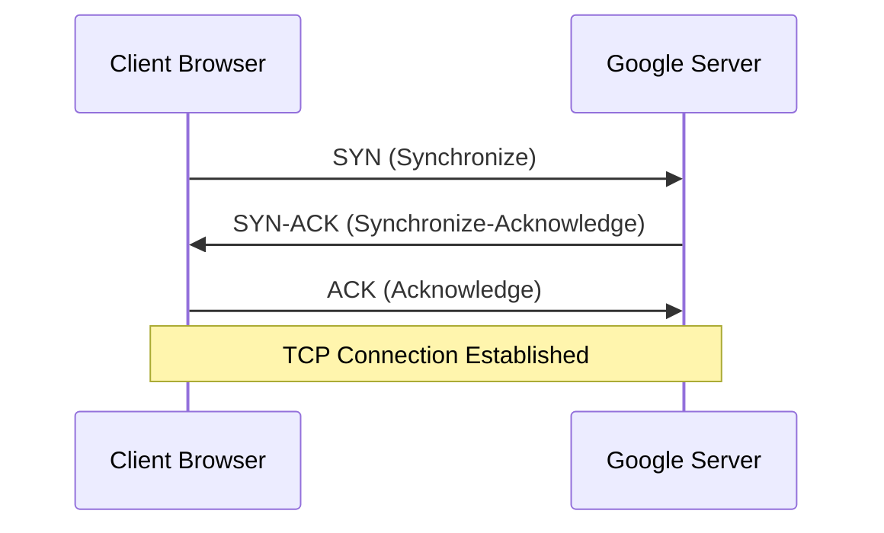

This three-step process establishes a reliable, ordered connection between your computer and Google's server.

TCP operates at Layer 4 of the OSI model (the Transport layer) and ensures that data arrives in the correct order and without loss. IP, operating at Layer 3 (the Network layer), handles the routing of packets across the internet, determining the physical path your data takes through various routers and networks.

This TCP connection provides the reliable foundation upon which HTTPS will be built. Without TCP/IP, there would be no guaranteed delivery of data across the internet.

## Firewall: The Security Gatekeeper

Before your request reaches Google's servers, it must pass through firewalls. Firewalls exist at multiple points in the network journey:

- On your own device
- At your ISP's edge
- At Google's data center perimeter

A firewall is a network security system that monitors incoming and outgoing network traffic and applies predetermined rules to allow or block traffic. In your case, your outgoing connection to port 443 (HTTPS) is almost certainly allowed by your local firewall, as this is standard for web browsing.

When your request reaches Google's data center, it encounters their firewall systems. These firewalls inspect the incoming traffic and apply sophisticated rules to detect and block malicious requests, DDoS attacks, and other threats. Google's firewalls are configured to allow legitimate HTTPS traffic on port 443, so your request passes through safely.

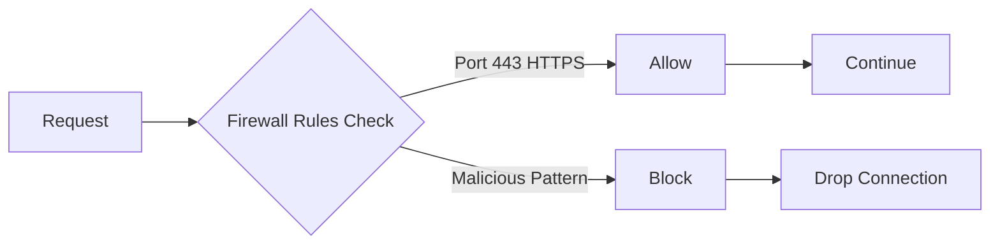

Firewalls provide the first line of defense in network security, protecting servers from unauthorized access and malicious traffic.

## HTTPS/SSL: Securing the Communication

Now that you have a TCP connection established and your traffic has passed through firewalls, the real security protocol begins. HTTPS (HyperText Transfer Protocol Secure) is implemented using SSL/TLS (Secure Sockets Layer/Transport Layer Security).

Your browser initiates a TLS handshake with Google's server. During this handshake:

1. The server sends its SSL certificate, which contains the server's public key and is digitally signed by a Certificate Authority (CA)
2. Your browser verifies this certificate by checking the certificate chain and confirming it's for the correct domain
3. Both parties agree on a cipher suite and encryption algorithm
4. They exchange keys through asymmetric encryption to establish a shared symmetric encryption key
5. All subsequent communication is encrypted using this key

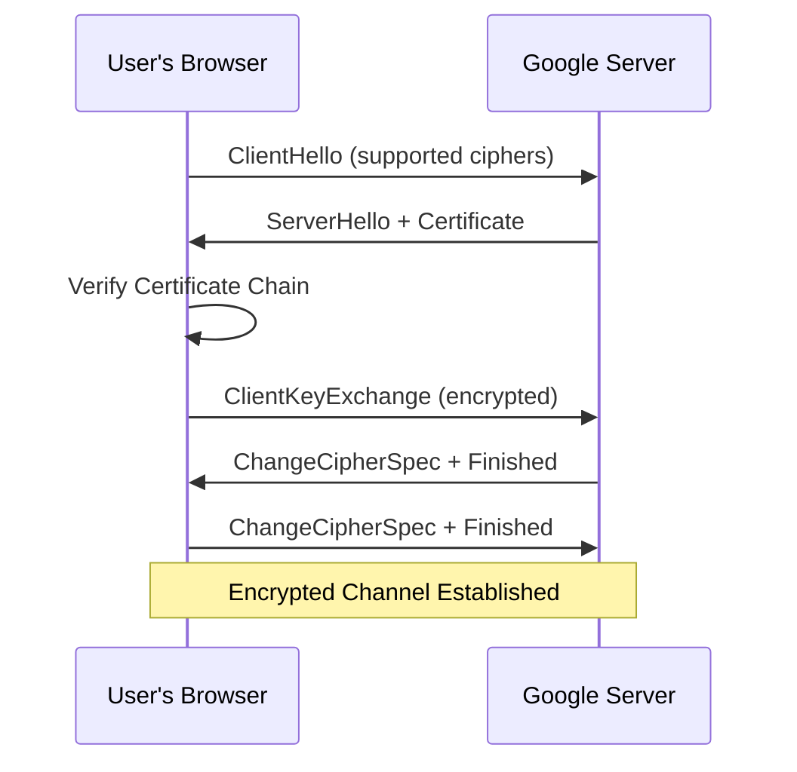

HTTPS ensures that your communication is:
- Confidential (encrypted so only you and Google can read it)
- Authenticated (you're actually talking to Google's servers)
- Integrated (the data hasn't been tampered with in transit)

Without HTTPS, your traffic could be intercepted and read by anyone with access to your network.

## Load Balancer: Distributing the Request

Your HTTPS request doesn't go directly to a single web server. Instead, it first hits Google's load balancer. A load balancer is a specialized piece of hardware or software that distributes incoming network traffic across multiple servers.

Google receives billions of requests per day, far too many for a single server to handle. The load balancer uses various algorithms to determine which of Google's many servers should handle your request:

- Round-robin: distributes requests equally in order
- Least connections: sends requests to the server with fewest active connections
- IP hash: routes based on client IP to maintain session affinity
- Weighted round-robin: considers server capacity differences

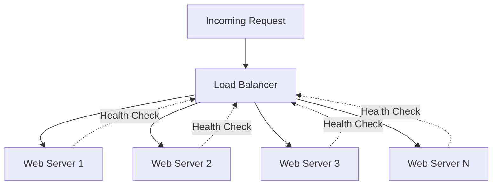

The load balancer also provides other critical functions:
- Performs health checks on backend servers
- Automatically removes failed servers from the pool
- Terminates the TLS connection on behalf of backend servers, reducing computational load
- Routes requests to geographically close data centers for reduced latency

In this case, the load balancer might route your request to a Google web server in a data center geographically close to you.

## Web Server: Processing the Request

Your request finally reaches a web server, perhaps Nginx, Apache, or Google's own custom server software. The web server is responsible for receiving your HTTP request and determining how to respond.

The web server parses your HTTP request, which includes:
- Method: GET
- Path: /
- HTTP version: HTTP/1.1 or HTTP/2
- Headers: User-Agent, Accept-Language, etc.

The web server then checks if the requested resource (in this case, Google's homepage) is cached locally. If not, it determines whether the request should be forwarded to an application server for dynamic processing.

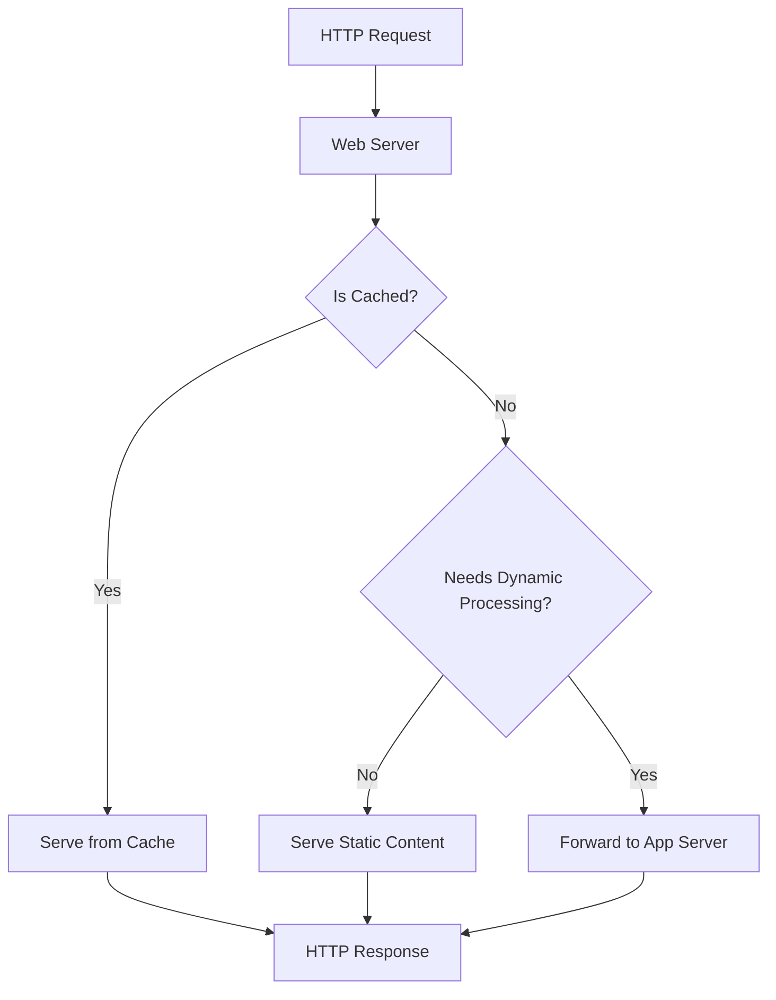

For Google's homepage, which is highly optimized and cached, the web server might serve a pre-generated version directly. However, if you were to perform a search, the request would need to go deeper into the stack.

## Application Server: Business Logic and Processing

For more complex requests than just the homepage, an application server comes into play. Application servers run the business logic of the web application. In Google's case, this is where complex algorithms run to:
- Determine search results from massive indexes
- Personalize the homepage
- Handle various user interactions
- Process user sessions

The application server executes code written in languages like Python, Java, C++, or Go, generating dynamic content based on the request parameters. For a search query, the application server would parse your search terms and prepare them for database queries.

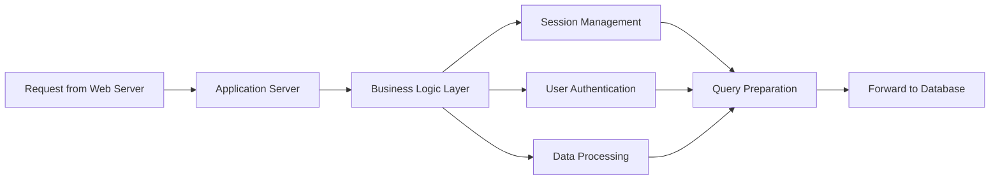

Application servers also handle:
- Session management and persistence
- User authentication and authorization
- Caching of frequently accessed data
- Transaction management

## Database: Retrieving and Storing Data

Finally, for requests that require data, the application server queries one or more databases. Google uses highly distributed, fault-tolerant database systems to store enormous amounts of data:
- Web page indexes
- Search algorithms and rankings
- User information
- Analytics and logs

The database receives a query from the application server and returns the requested data. In Google's case, searching likely involves querying massive indexes of the web, ranking results by relevance, and compiling the final list of pages to return to the user.

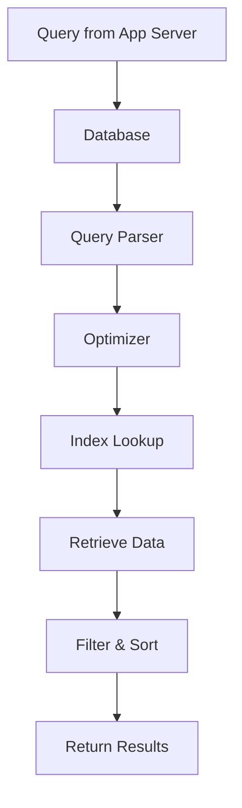

Database systems are optimized for fast queries and include:
- Multiple replicas across different geographic locations for reliability
- Various caching layers to reduce disk I/O
- Indexing strategies for quick lookups
- Sharding to distribute data across multiple servers

## The Response: Traveling Back

Once the database returns data (if needed), the response travels back through the stack:

```mermaid
graph LR
    A["Database"] --> B["Application Server"]
    B --> C["Web Server"]
    C --> D["Load Balancer"]
    D --> E["Firewall"]
    E --> F["User's Browser"]
    F --> G["HTML Parser"]
    G --> H["CSS Renderer"]
    H --> I["JavaScript Engine"]
    I --> J["DOM Rendering"]
    J --> K["Visual Webpage"]
```

The web server packages the response into an HTTP response with headers and the response body (typically HTML), and this travels back through the encrypted TLS connection to your browser.

Your browser receives the HTML document and begins parsing and rendering it. It fetches additional resources referenced in the HTML (CSS stylesheets, JavaScript files, images) through additional HTTP requests, each following a similar path through the entire stack described above.

The browser's JavaScript engine executes any JavaScript code, the CSS is applied to style the elements, and finally, the DOM (Document Object Model) is rendered on your screen as a visual webpage.

## Complete System Architecture

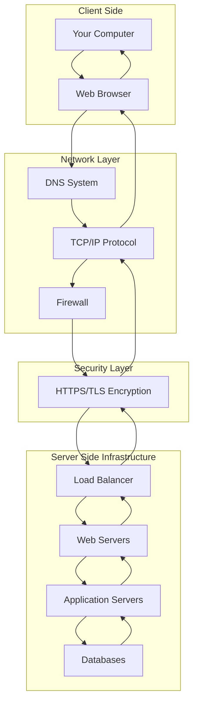

## Conclusion

What appears to be an instantaneous action actually involves an intricate coordination of systems across the entire internet stack:

- DNS translates human-readable names to IP addresses
- TCP/IP provides reliable data transmission across networks
- Firewalls protect against threats and unauthorized access
- HTTPS secures your communication through encryption and authentication
- Load balancers distribute traffic across multiple servers for scalability
- Web servers handle HTTP requests and serve content
- Application servers execute business logic and dynamic processing
- Databases store and retrieve vast amounts of data efficiently

Each component plays a vital role in the process. Understanding this complete flow is essential for any software engineer, whether you're building frontend interfaces, optimizing server infrastructure, designing robust systems, or preparing for technical interviews.

The next time you type a URL and press enter, remember the thousands of engineers, millions of lines of code, and complex distributed systems working together to bring you that webpage in milliseconds.
